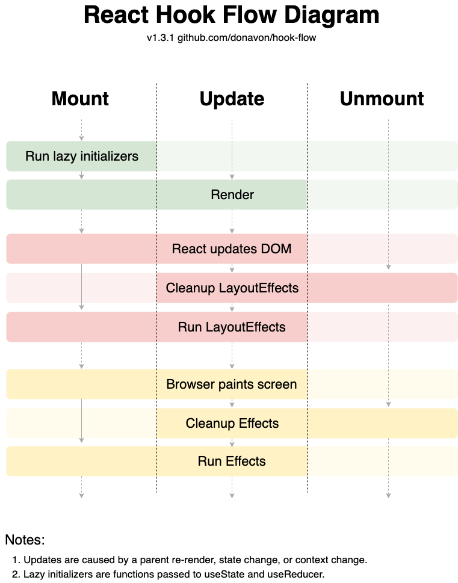

# Topic: useEffect

- `useEffect` is used for side effects like API calls, subscriptions, timers, and DOM-related work.

- Effects run after React renders and updates the DOM.

- `useEffect(() => {}, [])` runs only after the first render.

- `useEffect(() => {}, [value])` runs when the dependency value changes.

- Without a dependency array, `useEffect` runs after every render.

- Always include required dependencies to avoid stale values and hidden bugs.

- Return a cleanup function to remove timers, listeners, subscriptions, or pending work.

- Common mistake: using `useEffect` for derived state that can be calculated during render.

- Interview trap: `useEffect` does not block rendering; it runs after paint in most cases.

- Real-world use: fetching data, syncing external systems, handling resize listeners, and cleanup logic.

## One-Line Final Recall

`useEffect` lets React run side effects after render and clean them up when dependencies change or the component unmounts.


---

### 1. What problem does `useEffect` solve in React components?

`useEffect` lets a component run side effects after React renders the UI. It is used for work that needs to happen outside the render process, such as API calls, subscriptions, timers, logging, or manually interacting with the DOM.

```jsx
function UserProfile({ userId }) {
  useEffect(() => {
    fetchUser(userId);
  }, [userId]);

  return <div>User Profile</div>;
}
```

Without `useEffect`, side-effect logic may run during rendering, which can make components unpredictable.

---

### 2. When does `useEffect` run during the React rendering lifecycle?

`useEffect` runs after React finishes rendering and commits the UI changes to the DOM. In most cases, it runs after the browser has painted the updated screen.

```jsx
function Example() {
  useEffect(() => {
    console.log("Effect runs after render");
  });

  console.log("Render runs first");

  return <div>Hello</div>;
}
```

Render happens first, then React updates the DOM, and then the effect runs.

---

### 3. What is the difference between rendering logic and effect logic?

Rendering logic calculates what the UI should look like based on props and state. Effect logic synchronizes the component with something outside React, such as network requests, browser APIs, timers, or subscriptions.

```jsx
function Product({ price, quantity }) {
  const total = price * quantity; // rendering logic

  useEffect(() => {
    document.title = `Total: ${total}`; // effect logic
  }, [total]);

  return <div>{total}</div>;
}
```

Render logic should be pure. Effect logic is for external side effects.

---

### 4. Why should side effects not be performed directly inside the component body?

The component body should stay pure because React may call it multiple times during rendering. If side effects run directly inside the component body, they can execute unexpectedly and cause duplicate API calls, subscriptions, or inconsistent behavior.

```jsx
function UserProfile({ userId }) {
  // Wrong: side effect during render
  fetchUser(userId);

  return <div>User Profile</div>;
}
```

Better:

```jsx
function UserProfile({ userId }) {
  useEffect(() => {
    fetchUser(userId);
  }, [userId]);

  return <div>User Profile</div>;
}
```

---

### 5. What does the dependency array in `useEffect` control?

The dependency array controls when the effect should re-run. React compares the dependencies between renders, and if any dependency changes, the effect runs again.

```jsx
useEffect(() => {
  fetchUser(userId);
}, [userId]);
```

Here, the effect runs after the first render and again whenever `userId` changes.

---

### 6. What happens when `useEffect` is used without a dependency array?

When `useEffect` has no dependency array, it runs after every render. This means it runs after the initial render and again after every re-render caused by state or prop changes.

```jsx
useEffect(() => {
  console.log("Runs after every render");
});
```

This can be useful in rare cases, but it can easily cause performance issues or repeated side effects.

---

### 7. What happens when `useEffect` is used with an empty dependency array?

When `useEffect` has an empty dependency array, it runs only after the initial mount. It does not re-run on later re-renders unless the component unmounts and mounts again.

```jsx
useEffect(() => {
  console.log("Runs only once after mount");
}, []);
```

This is commonly used for one-time setup logic, but the effect still captures values from the initial render.

---

### 8. What happens when `useEffect` has specific dependencies in the dependency array?

When dependencies are provided, the effect runs after the initial render and again whenever one of those dependencies changes. React compares dependency values between renders.

```jsx
useEffect(() => {
  fetchUser(userId);
}, [userId]);
```

Here, the effect runs again only when `userId` changes.

---

### 9. Why does `useEffect` run after the browser paints the UI?

`useEffect` is designed for non-blocking side effects. React lets the browser paint the updated UI first, then runs the effect so the user does not wait for effect logic before seeing the screen.

```jsx
useEffect(() => {
  document.title = "Dashboard";
}, []);
```

This makes `useEffect` suitable for tasks like fetching data, logging, subscriptions, and updating external systems.

---

### 10. What is the purpose of the cleanup function in `useEffect`?

The cleanup function is used to remove or undo side effects before the effect runs again or before the component unmounts. It prevents memory leaks, duplicate subscriptions, and unwanted background work.

```jsx
import { useEffect, useState } from "react";

function CounterApp() {
  const [count, setCount] = useState(0);
  const [isRunning, setIsRunning] = useState(false);

  useEffect(() => {
    if (!isRunning) return;

    const intervalId = setInterval(() => {
      setCount((prevCount) => prevCount + 1);
    }, 1000);

    return () => {
      clearInterval(intervalId);
    };
  }, [isRunning]);

  return (
    <div>
      <h2>Count: {count}</h2>

      <button onClick={() => setIsRunning(true)}>Start</button>

      <button onClick={() => setIsRunning(false)}>Stop</button>

      <button
        onClick={() => {
          setIsRunning(false);
          setCount(0);
        }}
      >
        Reset
      </button>
    </div>
  );
}

export default CounterApp;
```

Here, cleanup stops the interval when the component unmounts.

---

### 11. When exactly does the cleanup function run?

The cleanup function runs before the effect runs again with new dependencies, and also when the component unmounts. React first cleans up the previous effect, then runs the new effect.

```jsx
useEffect(() => {
  console.log("Effect runs for:", userId);

  return () => {
    console.log("Cleanup runs for:", userId);
  };
}, [userId]);
```

If `userId` changes, cleanup runs for the old `userId` before the effect runs for the new `userId`.

---

### 12. Why is cleanup important for subscriptions, timers, and event listeners?

Cleanup prevents old side effects from continuing after the component updates or unmounts. Without cleanup, timers, subscriptions, and event listeners can keep running and cause memory leaks or duplicate behavior.

```jsx
useEffect(() => {
  function handleResize() {
    console.log(window.innerWidth);
  }

  window.addEventListener("resize", handleResize);

  return () => {
    window.removeEventListener("resize", handleResize);
  };
}, []);
```

Without cleanup, the resize listener may remain active even after the component is gone.

---

### 13. Why does `useEffect` run twice in React Strict Mode during development?

In React Strict Mode, React intentionally mounts, runs effects, cleans them up, and runs them again in development. This helps detect unsafe side effects, missing cleanup, and code that is not resilient to remounting.

```jsx
useEffect(() => {
  console.log("Effect ran");

  return () => {
    console.log("Cleanup ran");
  };
}, []);
```

This double execution happens only in development Strict Mode, not in production.

---

### 14. What is a stale closure problem in `useEffect`?

A stale closure happens when an effect uses an old value from a previous render because that value was captured when the effect was created. This usually happens when dependencies are missing.

```jsx
useEffect(() => {
  const id = setInterval(() => {
    console.log(count); // may always log old count
  }, 1000);

  return () => clearInterval(id);
}, []);
```

Here, the interval captures the initial `count` value because `count` is not included in the dependency array.

---

### 15. Why can missing dependencies in `useEffect` cause bugs?

Missing dependencies cause the effect to use outdated props or state. React will not re-run the effect when those values change, so the effect may work with stale data.

```jsx
useEffect(() => {
  fetchUser(userId);
}, []); // userId is missing
```

If `userId` changes, this effect will not run again, so the component may show or fetch the wrong data.

---

### 16. Why can adding unnecessary dependencies to `useEffect` cause repeated or infinite executions?

If a dependency changes on every render, the effect will also run after every render. If that effect updates state, it can create a loop where render triggers effect, effect updates state, and state triggers another render.

```jsx
function Example() {
  const [count, setCount] = useState(0);

  const user = { name: "John" }; // new object on every render

  useEffect(() => {
    setCount((prev) => prev + 1);
  }, [user]);

  return <div>{count}</div>;
}
```

Here, `user` is a new object every render, so the effect keeps running.

---

### 17. How should you handle async logic inside `useEffect`?

Define an async function inside the effect and call it. The effect callback itself should remain synchronous and optionally return a cleanup function.

```jsx
useEffect(() => {
  async function loadUser() {
    const response = await fetch(`/api/users/${userId}`);
    const data = await response.json();
    setUser(data);
  }

  loadUser();
}, [userId]);
```

This keeps the effect structure correct while still allowing async work inside it.

---

### 18. Why should the effect callback itself not be marked `async`?

An `async` function always returns a Promise, but `useEffect` expects the callback to return either nothing or a cleanup function. Returning a Promise can confuse React because React will not treat that Promise as a cleanup function.

```jsx
// Wrong
useEffect(async () => {
  const response = await fetch("/api/user");
  const data = await response.json();
  setUser(data);
}, []);
```

Better:

```jsx
useEffect(() => {
  async function loadUser() {
    const response = await fetch("/api/user");
    const data = await response.json();
    setUser(data);
  }

  loadUser();
}, []);
```

---

### 19. How can race conditions happen in data fetching inside `useEffect`?

Race conditions happen when multiple async requests are started, but they finish in a different order than expected. An older request may finish after a newer request and overwrite the latest state with stale data.

```jsx
useEffect(() => {
  async function loadUser() {
    const response = await fetch(`/api/users/${userId}`);
    const data = await response.json();
    setUser(data);
  }

  loadUser();
}, [userId]);
```

If `userId` changes quickly, the older request may finish last and update the UI with the wrong user.

---

### 20. How can you prevent setting state on outdated async responses inside `useEffect`?

Use a cleanup flag or `AbortController` to ignore or cancel outdated requests. This ensures only the latest effect updates state.

```jsx
useEffect(() => {
  let ignore = false;

  async function loadUser() {
    const response = await fetch(`/api/users/${userId}`);
    const data = await response.json();

    if (!ignore) {
      setUser(data);
    }
  }

  loadUser();

  return () => {
    ignore = true;
  };
}, [userId]);
```

When `userId` changes, React runs cleanup for the old effect, so the old response will be ignored.

---

### 21. When should you avoid using `useEffect` altogether?

Avoid `useEffect` when the value can be calculated during render from existing props or state. `useEffect` should be used for synchronizing with external systems, not for normal render calculations.

```jsx
// Avoid
const [fullName, setFullName] = useState("");

useEffect(() => {
  setFullName(firstName + " " + lastName);
}, [firstName, lastName]);
```

Better:

```jsx
const fullName = firstName + " " + lastName;
```

---

### 22. Why is deriving state inside `useEffect` often a bad pattern?

Deriving state inside `useEffect` causes an extra render because React first renders with old state, then the effect runs and updates state again. It can also create synchronization bugs if the derived value gets out of sync.

```jsx
// Avoid
const [total, setTotal] = useState(0);

useEffect(() => {
  setTotal(price * quantity);
}, [price, quantity]);
```

Better:

```jsx
const total = price * quantity;
```

If a value can be calculated from props or state during render, usually do not store it separately.

---

### 23. What is the difference between `useEffect` and `useLayoutEffect`?

`useEffect` runs after React commits the DOM updates and usually after the browser paints. `useLayoutEffect` runs synchronously after DOM updates but before the browser paints, so it can block visual updates.

```jsx
useEffect(() => {
  console.log("Runs after paint");
}, []);

useLayoutEffect(() => {
  console.log("Runs before paint");
}, []);
```

Use `useLayoutEffect` only when you must measure or modify layout before the user sees the screen.

---

### 24. How does React internally store and schedule effects on the component Fiber?

React stores effect information on the component's Fiber during render. After the render is committed, React schedules passive effects like `useEffect` to run after the DOM has been updated.

```jsx
function Example() {
  useEffect(() => {
    console.log("effect");
  }, []);

  return <div>Hello</div>;
}
```

Internally, this effect is recorded on the Fiber and executed later in the commit/passive effect phase.

---

### 25. How does React use hook call order to match `useEffect` calls across renders, and why does this make conditional effects invalid?

React matches hooks by the order they are called during render. If `useEffect` is called conditionally, the hook order can change between renders, causing React to connect the wrong hook data or effect.

```jsx
function Example({ enabled }) {
  if (enabled) {
    useEffect(() => {
      console.log("Enabled");
    }, []);
  }

  useEffect(() => {
    console.log("Always runs");
  }, []);
}
```

If `enabled` changes, the hook order changes. That is why `useEffect` must always be called at the top level of the component.

---

### 26. Based on the React Hook flow diagram, when do lazy initializers, layout effects, and normal effects run during mount, update, and unmount?


React runs lazy initializers only during the mount phase before the initial render. After React updates the DOM, `useLayoutEffect` cleanup runs before new layout effects, then the browser paints, and finally `useEffect` cleanup and new effects run.

On unmount, React runs cleanup for layout effects before cleanup for normal effects.

```jsx
const [count, setCount] = useState(() => {
  console.log("Lazy initializer");
  return 0;
});

useLayoutEffect(() => {
  console.log("Layout effect");

  return () => {
    console.log("Layout cleanup");
  };
}, []);

useEffect(() => {
  console.log("Normal effect");

  return () => {
    console.log("Effect cleanup");
  };
}, []);
```
